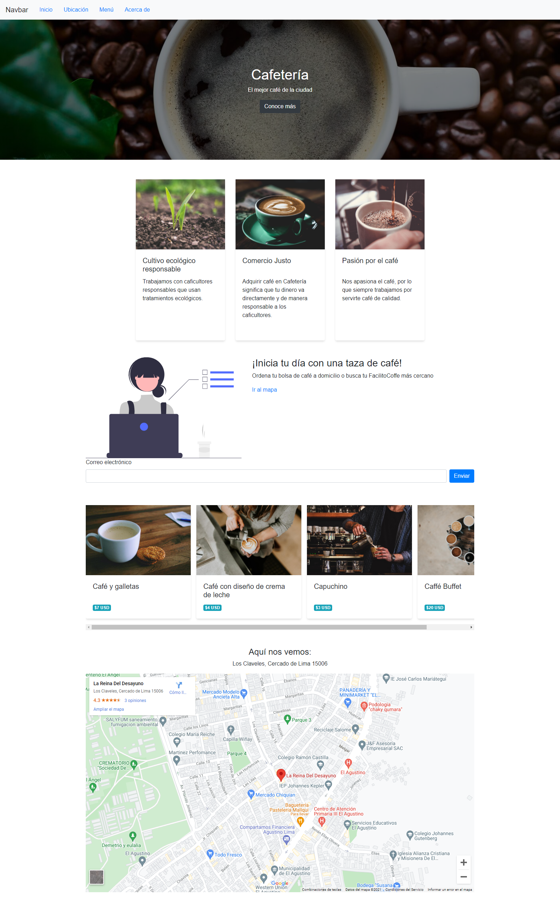

# Página Landing para una Cafetería

Página web de una cafetería hecho con CSS y HTML.
Se realizó esta página para practicar los conceptos de HTML y CSS.
Enlace: https://rquispeq.github.io/pagina_cafeteria

# Tecnologías utilizadas
* HTML5
* CSS3

# Elementos.
1. Barra de navegación
1. Portada con título, descripción y botón de Ver más
1. Sección de carácteristicas de la empresa.
   1. Elementos tipo Card
1. Sección de contacto
1. Sección de productos de venta
   1. Elementos tipo Card 
   1. Elementos tipo flex.
1. Sección de Google Maps a través de iframe

# Pantalla
